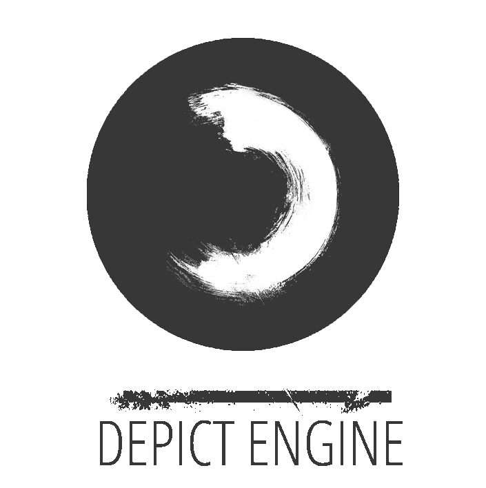

# Depict Engine
<p align="center">
    
</p>
<p align="center">
    
    
</p>


**Depict** is a  C++ OpenGL Graphics Engine

[Latest Version 1.20.11](https://github.com/jsmaatta/Depict)

Features
--------
- Supports **MacOS**
- Made in C++
- GPU support with OpenGL **4.1**
- Supports GPU instancing
- Built as a static library for ease-of-use

Dependencies
------------
- [SDL2](https://www.libsdl.org/) or [GLFW](https://github.com/glfw/glfw) support
- OpenGL Mathematics ([GLM](https://github.com/g-truc/glm))
- Open Asset Import Library ([ASSIMP](https://github.com/assimp/assimp))
- Dear [ImGui](https://github.com/ocornut/imgui)

Ease of use
-----------

```
#include "depict.h"
#include "depictmath.h"

using namespace depict;

int main() {

    // Code here

    return 0;
}
```

Copyright (c) **Jukka Maatta** 2020
